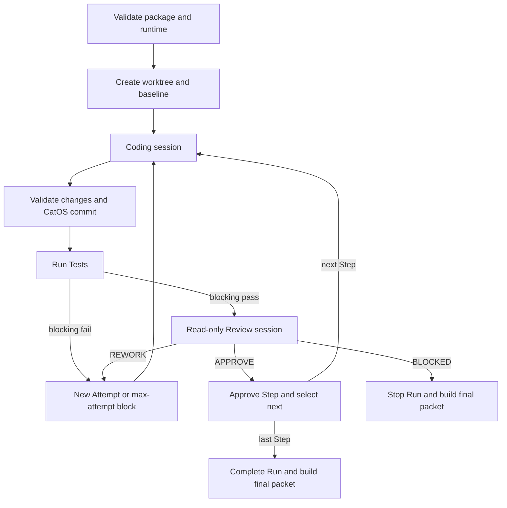

# AutoCodex 2.0 MVP

## Audit návrhu a revidovaná specifikace

**Stav dokumentu:** návrh implementačního kontraktu MVP  
**Datum auditu:** 17. 7. 2026  
**Určení:** příloha projektu CatOS v ChatGPT  

---

## 0. Výsledek auditu

Původní návrh má správně zvolenou hranici MVP: jeden předem schválený Task, sekvenční Steps, jeden Coding běh, deterministické Tests, oddělený Review běh a žádný člověk uvnitř Runu. Nevyžaduje nový orchestrátor, databázi, další modelového poskytovatele ani integraci s běžným ChatGPT chatem.

Návrh však v původním znění ještě není dostatečně přesný jako implementační specifikace. Největší problémy nejsou chybějící funkce, ale nejasné vlastnictví rozhodnutí, přílišná důvěra v modelové výstupy a nadsazené bezpečnostní či reprodukční garance.

Po zapracování níže uvedených úprav je koncept vhodný pro AutoCodex 2.0 MVP.

### Závazné úpravy před implementací

| Priorita | Zjištění | Úprava pro MVP |
| --- | --- | --- |
| Kritická | Coding agent má vytvářet výsledný commit. Model by tím ovládal hranici artefaktu, který má CatOS následně kontrolovat. | Codex pouze upraví pracovní strom a vrátí strukturovaný výsledek. Změny, rozsah a HEAD ověří CatOS; teprve potom vytvoří commit CatOS. |
| Kritická | Task je popsán převážně Markdown soubory, ale CatOS má podle něj automaticky rozhodovat. | Přidat strojově validovaný `task.json`. Markdown zůstane lidským zadáním; řídicí hodnoty bere CatOS pouze z JSON manifestu. |
| Kritická | Izolovaný worktree a omezené proměnné jsou označeny jako hlavní ochrana při `danger-full-access`. | Výslovně uvést, že worktree je provozní oddělení, nikoli bezpečnostní sandbox. `danger-full-access` smí běžet jen na důvěryhodném, ideálně jednorázovém runneru bez projektových secrets. |
| Vysoká | Reviewer „nesmí měnit soubory“, ale zákaz není technicky vynucen. | Review spouštět v `read-only` režimu. Pokud jej dané prostředí neumí spolehlivě spustit, Run se nesmí tiše přepnout na plný přístup. |
| Vysoká | Není přesně definováno, vůči kterému commitu se kontroluje diff, zejména při REWORK. | Uložit `taskBaseCommit`, `stepBaseCommit`, `attemptBaseCommit` a `resultCommit`. Reviewer dostane kumulativní diff Stepu i delta diff aktuálního Attemptu. |
| Vysoká | Neúspěšné povinné Tests jsou posílány Reviewerovi, přestože Step nemůže schválit. | Povinný test fail vyvolá deterministický REWORK bez Review volání. Review se spouští až po úspěchu všech povinných kontrol. |
| Vysoká | Technické selhání a věcný požadavek na opravu se mohou spotřebovávat stejným mechanismem Attempts. | Neplatný JSON, pád procesu, timeout nebo porušení protokolu znamená `FAILED`, ne `REWORK`. Attempt limit slouží pouze pro věcné iterace implementace. |
| Vysoká | „Bez dodatečných modelových nákladů“ je formulováno absolutně. | Garantovat pouze režim bez Platform API účtování: ChatGPT autentizace, žádný API klíč a žádný automatický fallback. Využití nadále podléhá limitům a případným kreditům ChatGPT účtu. |
| Střední | „Nezávislý Review“ může být chápán jako nezávislý modelový úsudek. | Použít přesnější termín „oddělená čistá Review session“. Je oddělený kontext a role, nikoli nezávislý poskytovatel nebo konsenzus. |
| Střední | Reprodukovatelnost modelového Runu je formulována příliš silně. | Garantovat dohledatelnost vstupů a možnost replaye, ne bitově shodný modelový výsledek. Zaznamenat verze, model, prompty, commity, příkazy a hashe artefaktů. |
| Střední | Není definováno chování při souběhu, pádu procesu nebo špinavém worktree. | Přidat file lock, atomický zápis stavových JSON souborů a fail-closed kontroly čistoty před každou fází. Automatické obnovení rozpracovaného Runu není součástí MVP. |

### Verdikt

Architekturu není třeba rozšiřovat. Je třeba ji zpřesnit a přesunout autoritu z modelů do CatOSu. Model smí navrhovat a hodnotit; CatOS musí vlastnit stav, Git, validaci, spouštění příkazů a všechny přechody.

---

# Revidovaný návrh AutoCodex 2.0 MVP

## 1. Účel

AutoCodex 2.0 MVP automatizuje provedení předem připraveného a člověkem schváleného vývojového Tasku prostřednictvím opakovaného cyklu:

**Feeder → Codex Coding → CatOS Change Validation → Tests → Codex Review → další Step nebo Rework**

Cílem MVP není nahradit člověka při plánování, architektonickém rozhodování ani finálním schválení změn.

Cílem je ověřit, že CatOS dokáže bez běžného zásahu člověka:

1. načíst a validovat zmrazený Task Package,
2. postupně uvolňovat jeho Steps,
3. zadávat vždy právě jeden Step Coding session,
4. ověřit rozsah vzniklých změn a deterministicky vytvořit commit,
5. spustit předem schválené kontroly,
6. předat úspěšný výsledek oddělené Review session,
7. automaticky řídit věcné opravy v omezeném počtu Attempts,
8. korektně Run dokončit nebo zastavit,
9. vytvořit úplný a dohledatelný auditní balíček.

---

## 2. Hranice MVP

### 2.1 Manuální fáze před Runem

Human a ChatGPT připraví a schválí:

- cíl Tasku,
- výchozí Git commit,
- rozsah povolených změn,
- pořadí Steps,
- acceptance criteria každého Stepu,
- omezení a zakázané zásahy,
- přesné testovací příkazy,
- limit Attempts a časové limity.

Výsledkem je verzovaný Task Package uložený v repozitáři. Jeho strojová část projde JSON Schema validací. CatOS při založení Runu uloží přesný snapshot nebo kryptografický hash vstupního balíčku; pozdější změna zdrojových souborů nesmí změnit již běžící Run.

### 2.2 Automatická fáze

Po úspěšném preflightu již běžný průběh nečeká na lidské potvrzení.

Automatickou část tvoří:

- CatOS orchestrátor,
- deterministický Feeder,
- čisté Codex Coding sessions,
- validace změn řízená CatOSem,
- deterministické Tests,
- čisté Codex Review sessions,
- Git a worktree operace vlastněné CatOSem,
- stavový automat,
- auditní logy.

Nouzové zrušení Runu je dovoleno. Není to rozhodovací Human Gate, ale provozní bezpečnostní mechanismus.

### 2.3 Manuální fáze po Runu

Po dokončení nebo zastavení Runu Human a ChatGPT posoudí `final-review-packet.md` a rozhodnou o:

- merge,
- navazujícím Tasku,
- přepracování plánu,
- zamítnutí výsledku.

Automatický merge, push, PR ani finální GPT review nejsou součástí MVP.

---

## 3. Základní principy

### 3.1 Pouze OpenAI modelový ekosystém

Všechny modelové úlohy automatické fáze provádí Codex CLI. MVP nepoužívá:

- modely jiných poskytovatelů,
- OpenAI Platform API,
- automatické volání běžného ChatGPT chatu,
- automatizaci webového rozhraní ChatGPT.

### 3.2 Předplatitelský režim bez Platform API účtování

Codex CLI používá uložené přihlášení přes ChatGPT účet. `codex exec` umí toto lokální přihlášení znovu použít a aktivní způsob autentizace lze ověřit pomocí `codex login status`.

Pro Run v předplatitelském režimu platí:

- CatOS před startem ověří ChatGPT autentizaci,
- vynutí login method `chatgpt`, pokud to použitá verze Codexu podporuje,
- odstraní z modelových procesů `OPENAI_API_KEY`, `CODEX_API_KEY`, `CODEX_ACCESS_TOKEN` a případné proměnné vlastního provideru,
- nepovolí automatický fallback na API key nebo jiného provideru,
- vypne Fast mode, není-li výslovně součástí schválené runtime konfigurace,
- do `runtime.json` uloží pouze typ autentizace, nikoli token nebo jeho část.

Tato pravidla garantují, že CatOS sám nevytvoří samostatně účtované Platform API volání. Negarantují neomezenou kapacitu ani absolutně nulové další výdaje: Codex při ChatGPT přihlášení podléhá limitům, kreditům a pravidlům daného ChatGPT plánu. Vyčerpání kapacity nesmí vyvolat API fallback; Run se zastaví s jednoznačným reason code.

### 3.3 Bez člověka uvnitř běžného Runu

Human Gate existuje pouze:

- před `START RUN`,
- po terminálním stavu Runu.

Výjimkou je pouze nouzové `CANCEL`, které neuděluje nové zadání a nepokračuje v práci.

### 3.4 Technická jednoduchost

MVP používá:

- jeden Task na Run,
- sekvenční Steps,
- právě jeden aktivní Attempt,
- jednu Coding session a následně nejvýše jednu Review session v Attemptu,
- jeden dedikovaný Git worktree,
- lokální souborový stav,
- Git commity vytvářené CatOSem,
- příkazy explicitně definované v Task Package,
- file lock proti souběžnému Runu nad stejným cílem.

MVP nepoužívá databázi, frontu, paralelní Steps, dynamické plánování, automatický merge ani distribuované workers.

---

## 4. Zdroj pravdy a Task Package

Markdown soubory jsou určeny člověku a modelu. CatOS z nich nesmí odvozovat řídicí hodnoty regulárními výrazy ani volným textovým parsováním.

Minimální balíček:

```text
tasks/<TASK_ID>/
  task.json
  TASK.md
  PLAN.md
  steps/
    STEP_001.md
    STEP_002.md
```

`task.json` je autoritativní pro:

- `schemaVersion`,
- `taskId`,
- neměnný `baseCommit` jako úplný Git SHA,
- seřazený seznam Step IDs,
- cesty k Markdown specifikacím,
- globální a Step-specific povolené/zakázané cesty,
- acceptance criteria identifikátory,
- testovací příkazy,
- povinnost jednotlivých kontrol,
- timeouts,
- `maxAttemptsPerStep`.

Příklad minimálního tvaru:

```json
{
  "schemaVersion": "autocodex.task.v1",
  "taskId": "TASK_042",
  "baseCommit": "0123456789abcdef0123456789abcdef01234567",
  "maxAttemptsPerStep": 3,
  "constraints": {
    "allowedPaths": ["src/**", "tests/**"],
    "forbiddenPaths": [".env", ".github/workflows/**"]
  },
  "steps": [
    {
      "id": "STEP_001",
      "specPath": "steps/STEP_001.md",
      "allowedPaths": ["src/**", "tests/**"],
      "acceptanceCriteria": ["AC-001", "AC-002"],
      "checks": ["typecheck", "unit"]
    }
  ],
  "checks": {
    "typecheck": {
      "argv": ["npm", "run", "typecheck"],
      "cwd": ".",
      "blocking": true,
      "timeoutSeconds": 600,
      "mustPassAtBaseline": true
    },
    "unit": {
      "argv": ["npm", "test"],
      "cwd": ".",
      "blocking": true,
      "timeoutSeconds": 1200,
      "mustPassAtBaseline": true
    }
  }
}
```

Příkazy se ukládají jako pole argumentů a CatOS je spouští bez shellové interpolace. Pokud konkrétní kontrola skutečně potřebuje shell, musí to být v manifestu výslovně označeno a schváleno před Runem.

---

## 5. Účastníci a autorita

### 5.1 CatOS

CatOS je jediný stavový orchestrátor a autorita pro:

- validaci Task Package,
- preflight,
- založení Runu a worktree,
- přidělení Stepů a Attempts,
- spouštění a ukončování procesů,
- pevné názvy a umístění artefaktů,
- ověření strukturovaných výstupů,
- kontrolu Git HEAD a pracovního stromu,
- kontrolu povolených cest,
- vytvoření Git commitů,
- spuštění Tests,
- přechody stavů,
- limity Attempts,
- terminální status a auditní balíček.

CatOS neposuzuje architektonickou kvalitu kódu. Deterministicky však odmítne výsledek, který porušuje protokol nebo schválený rozsah.

### 5.2 Feeder

Feeder je deterministická funkce uvnitř CatOSu. Ze zmrazených vstupů a verzované šablony sestaví prompt pro Coding nebo Review session.

Feeder:

- nesmí měnit cíle Tasku,
- nesmí přidávat architektonické požadavky,
- nesmí vybírat další Step pomocí modelu,
- nesmí interpretovat volný text jako změnu stavového automatu,
- uloží přesný prompt a hash použité šablony.

### 5.3 Codex Coding

Coding session:

- provede právě jeden aktuální Attempt jednoho Stepu,
- smí měnit pouze cesty povolené manifestem,
- může spouštět přiměřené průběžné kontroly,
- nesmí měnit Task Package,
- nesmí vytvářet commit, branch, tag, push ani PR,
- vrátí strukturovaný Coding result.

Coding session nerozhoduje o schválení Stepu.

Každý Attempt používá novou session. Rework prompt obsahuje potřebný aktuální stav, výsledky povinných Tests a konkrétní Review findings; nepoužívá skrytou paměť předchozí session.

### 5.4 Tests

Tests jsou deterministické procesy spouštěné CatOSem podle `task.json`.

Každá kontrola má:

- stabilní ID,
- přesné `argv`,
- pracovní adresář,
- příznak `blocking`,
- timeout,
- exit code,
- zachycený stdout a stderr,
- čas začátku a konce.

Tests nesmí zanechat pracovní strom změněný. Pokud test generuje snapshot, formátuje zdroj nebo jinak mění soubory, finální kontrola čistoty selže. Taková změna musí nejprve vzniknout v Coding fázi a být součástí kontrolovaného commitu.

### 5.5 Codex Review

Review session je nová, čistá session s oddělenou rolí a bez přístupu k předchozí konverzaci Coding agenta.

Dostane:

- Task a aktuální Step,
- acceptance criteria,
- relevantní pravidla repozitáře,
- `stepBaseCommit`, `attemptBaseCommit` a aktuální `resultCommit`,
- kumulativní diff celého Stepu,
- delta diff aktuálního Attemptu,
- Coding handoff,
- výsledky Tests.

Review běží technicky v režimu `read-only`. Nesmí upravovat pracovní soubory, vytvářet commity ani opravovat implementaci.

Povolená rozhodnutí jsou pouze:

- `APPROVE`,
- `REWORK`,
- `BLOCKED`.

„Oddělená session“ znamená nezávislý kontext a odlišnou roli. Neznamená nezávislého poskytovatele, jiný základní model ani multi-agent konsenzus.

---

## 6. Preflight a založení Runu

CatOS před první modelovou session provede všechny následující kontroly:

1. získá výhradní file lock pro cílový repozitář a Task,
2. validuje `task.json` proti podporovanému JSON Schema,
3. ověří existenci všech specifikací a jedinečnost Step IDs,
4. ověří, že `baseCommit` existuje a je neměnný SHA, nikoli pohyblivá branch,
5. ověří pravidla cest a odmítne nebezpečné nebo nejednoznačné hodnoty,
6. ověří dostupnost požadovaných příkazů,
7. ověří verzi Codex CLI a podporované přepínače,
8. ověří ChatGPT autentizační režim,
9. odmítne API key/provider fallback,
10. vytvoří dedikovaný worktree z přesného `baseCommit`,
11. ověří skutečné cesty pomocí `realpath` a Workspace Guard,
12. ověří čistý HEAD a pracovní strom,
13. spustí definované baseline checks,
14. uloží vstupní snapshot, runtime manifest a baseline výsledky.

Kontrola s `mustPassAtBaseline: true` musí na výchozím commitu projít. Pokud je účelem Tasku opravit již existující selhání, musí člověk u konkrétní kontroly předem nastavit `mustPassAtBaseline: false`; původní selhání se pak uloží do baseline artefaktů a kontrola stále musí projít ve výsledku.

Selhání preflightu nezaloží první Attempt a skončí reason codem `FAILED_PREFLIGHT` nebo přesnějším podkódem.

---

## 7. Automatický cyklus



### 7.1 Začátek Attemptu

CatOS:

- uloží `stepBaseCommit` při prvním Attemptu Stepu,
- uloží aktuální HEAD jako `attemptBaseCommit`,
- ověří čistý pracovní strom,
- vytvoří Coding prompt z verzované šablony,
- spustí novou Coding session s timeoutem.

### 7.2 Coding result a validace změn

Po skončení Coding session CatOS:

1. ověří exit code procesu,
2. validuje výstup proti Coding JSON Schema,
3. ověří, že Coding agent nezměnil Git HEAD,
4. získá úplný seznam změněných a untracked souborů,
5. ověří povolené a zakázané cesty,
6. ověří zákaz submodulů, tagů, branch operací a změny Task Package,
7. uloží `change-validation.json`,
8. při platném výsledku vytvoří commit jménem CatOSu,
9. uloží přesný `resultCommit`.

Vrátí-li Coding platný status `BLOCKED`, CatOS nevytvoří commit ani další Attempt. Step a Run ukončí jako `BLOCKED` s uloženým důvodem. Tento status je platný jen tehdy, když pokračování vyžaduje změnu zadání, chybějící externí předpoklad nebo rozhodnutí člověka; běžná implementační obtíž je věcný Rework, nikoli Blocked.

Neexistuje-li žádná změna a Step ji podle zadání vyžaduje, Attempt nemůže být automaticky schválen. Neodpovídá-li výsledek platnému `BLOCKED`, jde o protokolové selhání.

### 7.3 Tests

CatOS spustí všechny kontroly určené pro Step.

- Pokud selže blocking check, Review se nespouští.
- Attempt končí `REWORK` se zdrojem `TESTS`.
- Pokud zbývá další Attempt, Feeder předá Coding session konkrétní test failures.
- Pokud byl vyčerpán limit, Step a Run končí `BLOCKED` s reason codem `BLOCKED_MAX_ATTEMPTS`.
- Ne-blocking failures se zaznamenají a dostane je Reviewer; samy o sobě nevynucují REWORK.

Po Tests CatOS znovu ověří čistý pracovní strom a nezměněný HEAD.

### 7.4 Review

Review se spustí pouze po průchodu všech blocking checks.

- `APPROVE`: required changes musí být prázdné; CatOS označí Step jako schválený a uvolní další Step.
- `REWORK`: Reviewer musí vrátit alespoň jeden konkrétní, ověřitelný required change vztahující se k zadání nebo regresi.
- `BLOCKED`: Reviewer musí uvést důvod, proč nelze pokračovat bez změny schváleného Tasku, externího rozhodnutí nebo chybějícího předpokladu.

Reviewer nesmí použít `BLOCKED` pouze proto, že je oprava obtížná. Opravitelná chyba v rámci schváleného rozsahu je `REWORK`.

### 7.5 Poslední Step

Po schválení posledního Stepu CatOS:

- nastaví Run na `COMPLETED`,
- ověří finální čistotu worktree,
- vytvoří finální diff `taskBaseCommit..finalCommit`,
- sestaví auditní manifest a final review packet,
- neprovede push, PR ani merge.

---

## 8. Attempts a ukončování smyčky

Výchozí hodnota:

```text
maxAttemptsPerStep = 3
```

Attempt se započítá okamžikem spuštění Coding session. Nejvýše tři Coding běhy tedy znamenají `ATTEMPT_001` až `ATTEMPT_003`.

Do limitu patří věcné iterace:

- test failure po platné implementaci,
- Review `REWORK`.

Technické chyby se nesmějí maskovat jako věcný Rework:

- neplatný nebo chybějící JSON,
- pád child procesu,
- timeout,
- nesoulad Git HEAD,
- nepovolená změna souboru,
- nemožnost spustit read-only Review,
- poškozený stav Runu.

Taková chyba nastaví Attempt, Step a Run na `FAILED` s konkrétním reason codem. Automatické opakování technicky chybné fáze není součástí MVP; nový Run může po auditu založit člověk.

---

## 9. Stavy a reason codes

### 9.1 Run status

```text
CREATED
VALIDATING
RUNNING
COMPLETED
BLOCKED
FAILED
CANCELLED
```

### 9.2 Step status

```text
PENDING
ACTIVE
APPROVED
BLOCKED
FAILED
```

### 9.3 Attempt status

```text
CREATED
CODING
VALIDATING_CHANGES
TESTING
REVIEWING
APPROVED
REWORK
BLOCKED
FAILED
```

Stavy jsou záměrně jednoduché. Podrobnost nese samostatný `reasonCode`, například:

```text
REWORK_TESTS
REWORK_REVIEW
BLOCKED_REVIEW
BLOCKED_MAX_ATTEMPTS
BLOCKED_CAPACITY
FAILED_PREFLIGHT
FAILED_AUTH_MODE
FAILED_CODING_PROCESS
FAILED_INVALID_CODING_RESULT
FAILED_CHANGE_GUARD
FAILED_TEST_PROCESS
FAILED_REVIEW_PROCESS
FAILED_INVALID_REVIEW_RESULT
FAILED_STATE_INTEGRITY
```

Model vrací pouze svůj strukturovaný výsledek. Výsledný status a všechny přechody zapisuje CatOS.

---

## 10. Strukturované modelové výsledky

Codex sessions se spouštějí neinteraktivně přes `codex exec` s:

- JSONL event streamem pro audit,
- `--output-schema` pro finální výsledek,
- pevně určeným output path,
- explicitním sandbox režimem,
- timeoutem řízeným CatOSem.

CatOS validuje JSON Schema s `additionalProperties: false`. Markdown handoff nevytváří model do libovolně zvolené cesty; CatOS jej vyrenderuje na pevné místo ze strukturovaných polí.

### 10.1 Coding result

```json
{
  "status": "COMPLETED",
  "summary": "Implemented the requested validation.",
  "changes": [
    {
      "path": "src/validator.ts",
      "description": "Added schema validation."
    }
  ],
  "checksRunByAgent": ["npm run typecheck"],
  "remainingConcerns": []
}
```

Povolené Coding statusy jsou pouze `COMPLETED` a `BLOCKED`. Hodnoty `baseCommit`, `resultCommit` a cesty k artefaktům doplňuje CatOS, nikoli model.

### 10.2 Review result

```json
{
  "decision": "REWORK",
  "summary": "The change misses one acceptance criterion.",
  "requiredChanges": [
    {
      "severity": "major",
      "criterionId": "AC-002",
      "description": "Reject unknown schema versions.",
      "evidence": "src/validator.ts accepts any version string."
    }
  ],
  "nonBlockingNotes": []
}
```

`confidence` může být uložen jako diagnostická informace, ale nesmí řídit stavový automat. `APPROVE` s neprázdným `requiredChanges` nebo `REWORK` bez konkrétního required change je neplatný Review result a znamená technické selhání.

---

## 11. Git kontrakt

CatOS eviduje čtyři jasné hranice:

- `taskBaseCommit`: výchozí commit celého Runu,
- `stepBaseCommit`: HEAD před prvním Attemptem aktuálního Stepu,
- `attemptBaseCommit`: HEAD před aktuální Coding session,
- `resultCommit`: commit vytvořený CatOSem po validaci změn.

Review používá:

- `stepBaseCommit..resultCommit` pro úplný výsledek aktuálního Stepu,
- `attemptBaseCommit..resultCommit` pro změnu aktuálního Attemptu.

Každý implementační commit obsahuje v message `TASK_ID`, `STEP_ID`, `ATTEMPT_ID` a odkaz na Run ID. CatOS před i po každé fázi ověřuje HEAD a čistotu pracovního stromu.

Failed a Rework commity zůstávají v dedikované Run branch jako součást auditu a základ další opravy. Squash není součástí MVP; o výsledné podobě historie rozhodne člověk před merge.

---

## 12. Minimální artefakty Runu

```text
runs/<RUN_ID>/
  run.json
  runtime.json
  events.jsonl
  worktree.json
  input/
    task-package-manifest.json
    task-package.sha256
  baseline/
    test-results.json
    logs/

  steps/
    STEP_001/
      step.json
      attempts/
        ATTEMPT_001/
          attempt.json
          coding-prompt.md
          coding-events.jsonl
          coding-result.json
          coding-handoff.md
          changed-files.json
          change-validation.json
          commit.json
          tests/
            test-results.json
            logs/
          review-prompt.md
          review-events.jsonl
          review-result.json
          review.md

  final/
    run-summary.md
    final-review-packet.md
    final-diff.patch
    test-summary.json
    open-issues.md
    artifact-manifest.json
```

`runtime.json` minimálně zaznamená:

- CatOS verzi a commit,
- Codex CLI verzi,
- požadovaný a skutečně reportovaný model,
- Coding a Review sandbox režim,
- typ autentizace bez credential hodnot,
- hash runtime konfigurace a prompt šablon,
- OS/runtime/Git verze,
- začátek a konec Runu,
- task, step a attempt limity.

`artifact-manifest.json` obsahuje SHA-256 výsledných auditních souborů. Tím lze po finalizaci zjistit nechtěnou změnu balíčku. Lokální manifest bez externího podpisu není kryptografickým důkazem proti úmyslnému přepsání celého Runu a dokument to nesmí předstírat.

Logy mají definovaný maximální objem. Případné zkrácení musí být explicitně označeno; příkaz, exit code, timestamps a informace o truncation se vždy zachovají.

---

## 13. Bezpečnost a provozní oddělení

MVP zachovává:

- dedikovaný externí Git worktree,
- Workspace Guard,
- ověření cest pomocí `realpath`,
- zákaz kořene CatOSu, zdrojového repozitáře a obecných systémových cest,
- omezené prostředí child procesů,
- oddělené `HOME` a `TMPDIR`,
- vypnutý interaktivní Git prompt,
- runtime manifest bez secret values,
- zákaz automatického merge, push a PR,
- odstranění Git/hostovacích credentials z prostředí,
- read-only Review session.

### 13.1 Důležité omezení

`danger-full-access` vypíná ochranný sandbox Codexu. Worktree, `realpath`, environment allowlist ani následná Git kontrola nemohou zabránit modelovému příkazu číst nebo měnit jiné soubory dostupné stejnému OS uživateli. Mohou pouze omezit běžný provoz a odhalit část porušení uvnitř repozitáře.

Proto Coding s `danger-full-access` smí běžet pouze tehdy, když:

- runner je důvěryhodný a určený pro tento Run,
- repozitář a Task Package jsou předem schválené, nikoli obsah z nedůvěryhodného forku,
- na runneru nejsou projektové, GitHub, SSH, cloudové ani jiné nesouvisející secrets,
- Codex credential je považován za citlivý a runner není sdílen s nedůvěryhodným kódem,
- po Runu proběhne lidský audit před jakoukoli publikací.

Je-li požadována skutečná bezpečnostní izolace, musí ji poskytovat vnější OS/container/VM hranice. To není nová modelová funkce AutoCodexu, ale předpoklad bezpečného nasazení `danger-full-access`.

### 13.2 Princip minimálních oprávnění

- Coding používá `workspace-write`, pokud jej prostředí dokáže spolehlivě provozovat.
- `danger-full-access` je explicitní kompatibilitní režim pro kontrolovaný runner, nikoli výchozí bezpečný režim.
- Review vždy používá `read-only`.
- Tests spouští CatOS s minimálním prostředím a bez modelových autentizačních proměnných.

Pokud požadovaný sandbox režim selže, CatOS nesmí automaticky povolení rozšířit.

---

## 14. Konzistence a chování při pádu

Pro MVP platí:

- nad jedním Taskem/repozitářem smí běžet jen jeden aktivní Run,
- stavové JSON soubory se zapisují atomicky přes dočasný soubor a rename,
- každý přechod má monotónní sequence number v `events.jsonl`,
- CatOS před přechodem ověří očekávaný předchozí stav,
- při ukončení child procesu se ukončí celá jeho process group,
- po neočekávaném restartu CatOS rozpracovaný Run automaticky nepokračuje,
- neuzavřený Run se označí `FAILED_STATE_INTEGRITY` a zachová se pro audit,
- člověk může poté založit nový Run ze schváleného commitu.

Automatický resume a přesně-once obnova nejsou nutné pro ověření MVP a zbytečně by rozšířily stavový automat.

---

## 15. Co není součástí MVP

- GPT review uvnitř automatického cyklu,
- ChatGPT nebo OpenAI Platform API,
- automatický přenos do běžného ChatGPT chatu,
- GitHub connector jako součást orchestrace,
- automatické plánování Steps,
- změna Tasku během Runu,
- paralelní Steps,
- více současných Coding agentů,
- multi-agent consensus,
- modelové rozhodování o Git commitech,
- automatický merge, push nebo PR,
- automatické obnovení havarovaného Runu,
- vzdálení distribuovaní workers,
- obecný pluginový systém,
- kryptograficky podepsaný vzdálený audit log.

---

## 16. Kritérium úspěchu MVP

MVP je funkční, pokud CatOS v integračních scénářích prokáže, že dokáže bez běžného zásahu člověka:

1. přijmout a zmrazit jeden platný Task Package s několika Steps,
2. odmítnout neplatný manifest nebo nesprávný auth mode ještě před Coding session,
3. vytvořit worktree z přesného base SHA,
4. postupně provést všechny Steps,
5. ověřit změněné cesty a vytvořit každý commit CatOSem,
6. u každého dokončeného Stepu spustit Coding, blocking Tests a oddělené read-only Review,
7. provést alespoň jednu REWORK smyčku vyvolanou Tests,
8. provést alespoň jednu REWORK smyčku vyvolanou Reviewerem,
9. zastavit se při Review `BLOCKED`, vyčerpání Attempts nebo technickém selhání,
10. dokončit Run pouze při schválení všech Steps,
11. nezměnit worktree během Tests nebo Review,
12. vytvořit dohledatelný auditní balíček s prompty, výstupy, commity, příkazy, stavy a hash manifestem,
13. nepoužít API key, API provider fallback, push, PR ani merge,
14. při ChatGPT autentizaci nevytvořit žádné samostatně účtované OpenAI Platform API volání.

„Reprodukovatelnost“ zde znamená, že lze přesně dohledat vstupy a znovu sestavit stejný technický Run. Neznamená, že opakované modelové volání musí vrátit bitově shodný text nebo totožný patch.

---

## 17. Minimální akceptační scénáře

| Scénář | Očekávaný výsledek |
| --- | --- |
| Dva Steps, všechny Tests i Reviews projdou | `COMPLETED`, dva schválené Steps, finální packet |
| První Attempt neprojde blocking testem, druhý jej opraví | Review prvního Attemptu se nespustí; druhý může být schválen |
| Tests projdou, Reviewer vrátí konkrétní `REWORK` | Nový Attempt dostane findings a kumulativní kontext Stepu |
| Reviewer vrátí `BLOCKED` s platným důvodem | Run skončí `BLOCKED_REVIEW` |
| Třetí Attempt znovu vyžaduje Rework | Run skončí `BLOCKED_MAX_ATTEMPTS` |
| Coding vrátí neplatný JSON | Run skončí `FAILED_INVALID_CODING_RESULT` |
| Coding vytvoří vlastní commit nebo změní zakázaný soubor | Run skončí `FAILED_CHANGE_GUARD`; CatOS změnu neschválí |
| Review sandbox nelze spustit jako read-only | Run selže; nesmí se tiše použít plný přístup |
| Aktivní autentizace je API key nebo je přítomen provider fallback | Preflight Run odmítne |
| Proces se zasekne nad timeout | Process group se ukončí a Run skončí jednoznačným `FAILED_*` stavem |

---

## 18. Doporučené pořadí implementace

Nejde o nové funkce, ale o nejkratší cestu k ověřitelnému MVP:

1. `task.json` schema, validace a snapshot vstupu,
2. zjednodušený stavový automat a atomické ukládání,
3. preflight autentizace, runtime konfigurace a Run lock,
4. worktree a Git commit kontrakt vlastněný CatOSem,
5. jedna Coding session s `--output-schema`,
6. change guard a deterministické Tests,
7. jedna read-only Review session s `--output-schema`,
8. REWORK a max-attempt logika,
9. finální packet a hash manifest,
10. akceptační scénáře z předchozí kapitoly.

---

## 19. Konečná definice

AutoCodex 2.0 MVP je jednoduchý, sekvenční a auditovatelný automatický vývojový cyklus postavený na CatOSu, Codex CLI, Gitu a deterministických testech.

Modely provádějí Coding a oddělený Review. CatOS vlastní vstupní kontrakt, pracovní prostor, procesy, validaci změn, testy, Git commity, stavový automat a auditní stopu. Člověk schvaluje plán před Runem a výsledek po Runu.

Tato hranice je pro MVP dostatečná. Další vrstvy — GPT review, paralelizace, automatický PR, distribuovaná orchestrace nebo dynamické plánování — mají smysl až po prokázání spolehlivosti tohoto základního cyklu.

---

## 20. Ověřené předpoklady Codexu

Návrh vychází z aktuální veřejné dokumentace OpenAI k datu auditu:

- Codex CLI podporuje přihlášení přes ChatGPT pro předplatitelský přístup a `codex login status` pro kontrolu aktivní metody: [Authentication](https://learn.chatgpt.com/docs/auth).
- `codex exec` je určen pro neinteraktivní pipeline, umí JSONL event stream, `--output-schema`, explicitní sandbox a opakované použití uložené CLI autentizace: [Non-interactive mode](https://learn.chatgpt.com/docs/non-interactive-mode).
- `danger-full-access` vypíná sandboxová omezení a OpenAI jej doporučuje pouze pro kontrolované prostředí: [Sandbox and approvals](https://learn.chatgpt.com/docs/agent-approvals-security).
- ChatGPT přihlášení používá limity a kredity daného plánu, zatímco API key používá samostatné API účtování: [Codex pricing](https://learn.chatgpt.com/docs/pricing).
- Login method lze v řízeném prostředí omezit konfigurací a Codex stav ukládá pod `CODEX_HOME`: [Configuration reference](https://learn.chatgpt.com/docs/config-file/config-reference).
